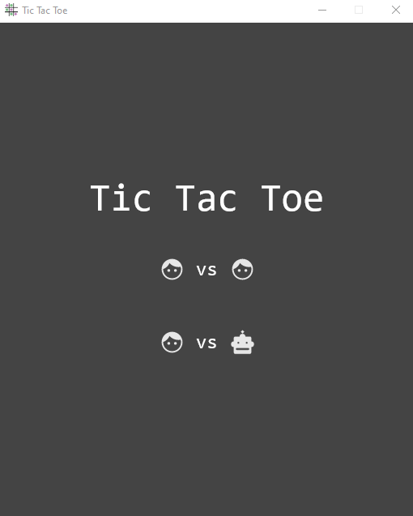
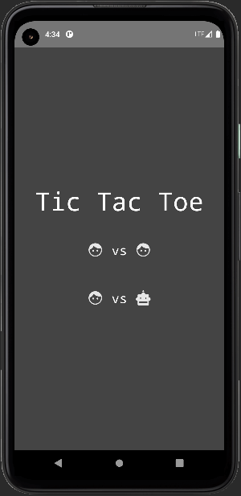
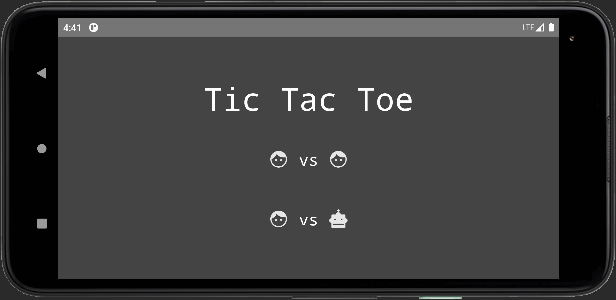

# :rocket: Tic Tac Toe :x::o::robot:

:video_game: A classic dual-mode Tic Tac Toe game for Desktop & Android built using **JetBrains** 
[Compose Multiplatform](https://www.jetbrains.com/lp/compose-mpp/).

## :memo: Game details

The classic game comes with two versions: a local 2-player mode and a single-player versus bot mode with switchable difficulty.

## :briefcase: Features

- All model data, logic, and UI components (except `ExitDialog`) shared in `:common`
- Platform-specific declarations using `expect`/`actual` for:
	- Pop-up dialog composable
	- Screen navigation sealed class
	- Resource getter within composables
- Robust model and UI test suites
- Navigation using `NavHost()` with back button handling for Android target
- Responsive UI for Android with state retention between configuration changes

## :computer: Run Desktop application

Clone the repository then pick an option:

- `./gradlew :desktop:run` from an open terminal in the root of the project

- Open the Gradle toolbar in IntelliJ IDEA and select `tic-tac-toe/Tasks/compose desktop/run`

## :microscope: Run tests

Clone the repository then pick an option:

- Open the project in IntelliJ IDEA and choose specific tests using gutter icons or right-click any test folder to choose to run all tests in that module

- Open the Gradle toolbar in IntelliJ IDEA and select `tic-tac-toe/Tasks/verification/allTests`

## :iphone: Run Android application

Clone the repository then open the project in IntelliJ IDEA (or Android Studio) and run the "android" configuration.